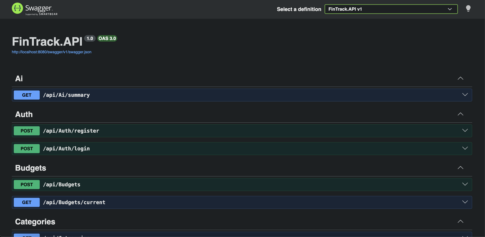
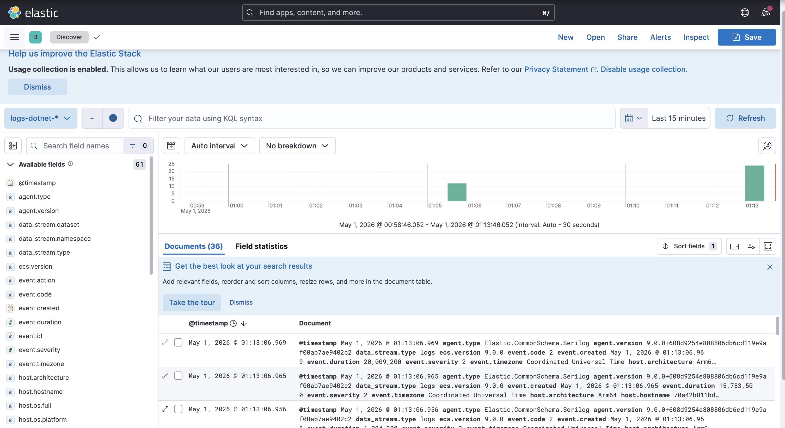
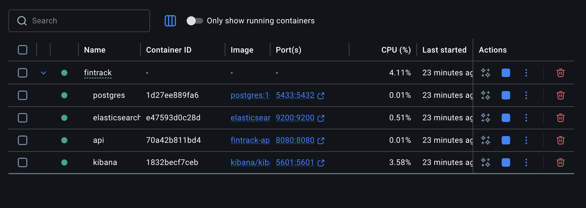

# 🚀 FinTrack API

FinTrack is a personal finance tracking API where users can manage income and expenses, organize transactions by categories, and get financial insights. It also includes AI-powered analysis for smarter spending awareness.

---

## 🧠 Features

- 🔐 JWT Authentication (Secure login & register)
- 👤 Multi-user system (Each user sees only their data)
- 💸 Income & Expense tracking
- 🗂 Category-based organization
- 📊 Financial reports (summary & category-based)
- 🎯 Monthly budget tracking
- 🤖 AI-powered financial insights (Gemini API)
- ⚠️ Global error handling (Custom Exception Middleware)
- 📜 Structured logging with Serilog
- 📡 Centralized logging with Elasticsearch
- 📊 Log monitoring via Kibana

---

## 🏗 Tech Stack

- ASP.NET Core Web API (.NET 10)
- Entity Framework Core
- PostgreSQL
- JWT Authentication
- FluentValidation
- Google Gemini API (AI)
- Serilog (Structured Logging)
- Elasticsearch & Kibana (Log Monitoring)
- Docker & Docker Compose
- Clean architecture principles

---

## 📸 Screenshots

### 🔹 Swagger API



👉 Shows all available API endpoints and testing interface.

---

### 🔹 Kibana Logs (Discover)



👉 Real-time logs streamed from Elasticsearch using Serilog.

---

### 🔹 Docker Containers



👉 API, PostgreSQL, Elasticsearch and Kibana running together.

---

## 📡 API Endpoints

### 🔐 Auth

- `POST /api/auth/register`
- `POST /api/auth/login`

### 💸 Transactions

- `GET /api/transactions`
- `POST /api/transactions`
- `PUT /api/transactions/{id}`
- `DELETE /api/transactions/{id}`

### 🗂 Categories

- `GET /api/categories`
- `POST /api/categories`
- `PUT /api/categories/{id}`
- `DELETE /api/categories/{id}`

### 📊 Reports

- `GET /api/reports/summary`
- `GET /api/reports/category-summary`

### 🎯 Budget

- `POST /api/budgets`
- `GET /api/budgets/current`

### 🤖 AI

- `GET /api/ai/summary`

---

## 🔑 Authentication

All protected endpoints require JWT token:

```http
Authorization: Bearer YOUR_TOKEN
```
